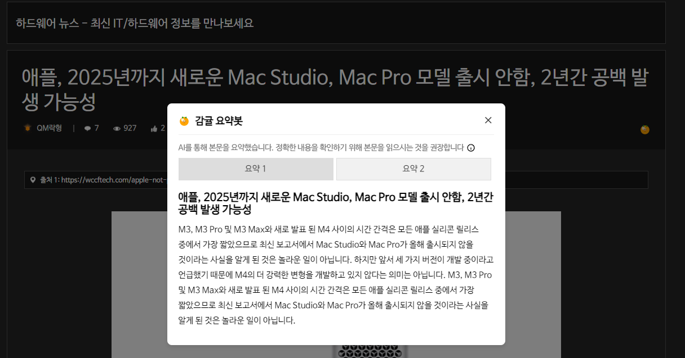

# QuasarSum
Quasarzone/Quasarplay News Content Summary Chrome Extension

# What is it?
This repository is a Chrome extension that summarizes news content from Quasarzone/Quasaplay.

It outputs the original sentences verbatim to preserve the original meaning. The summarization model code will be released in a separate repository at a later date.

# Example

# How to install?
1. Download this repository. On GitHub, click the green button on the right that says 'code' -> Download ZIP to download the archive and unzip it wherever you like. Alternatively, use `git clone` to clone this repository.
2. In the Chrome browser (or any Chromium-based browser), type [chrome://extensions](chrome://extensions) in the address bar, enable 'developer mode', and click 'install unzipped extension'. Then select the folder where you extracted it.

# Read the following!
1. Do not summarize if the original is too short.
2. Summaries can summarize the wrong thing, so we recommend reading the original.
3. The values sent to the server are not stored separately.

# License
This repository is distributed under the MIT license. Check the [LICENSE](./LICENSE) file.